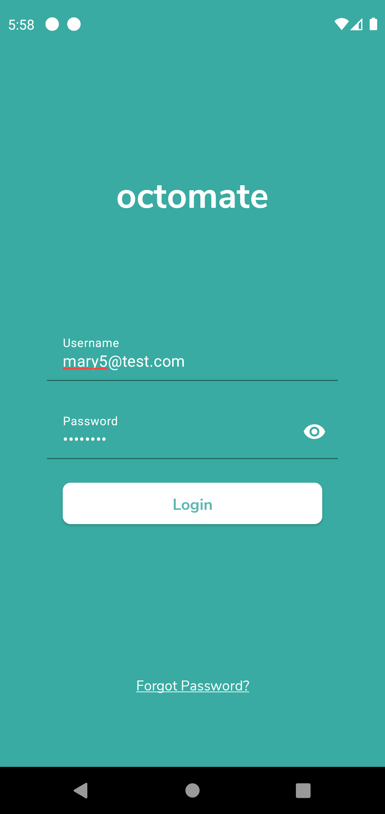
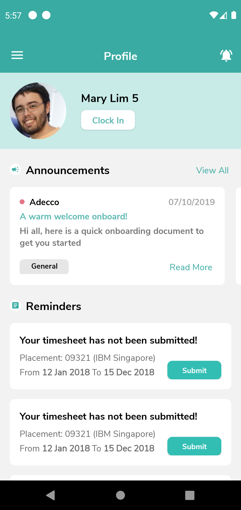
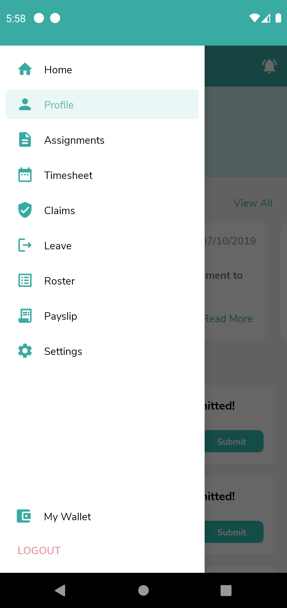
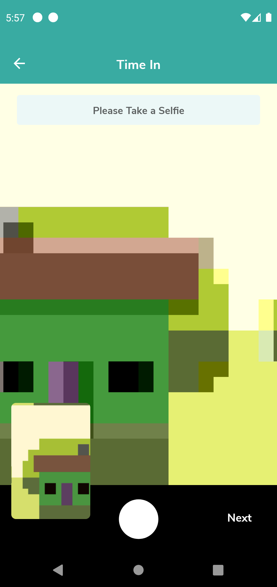
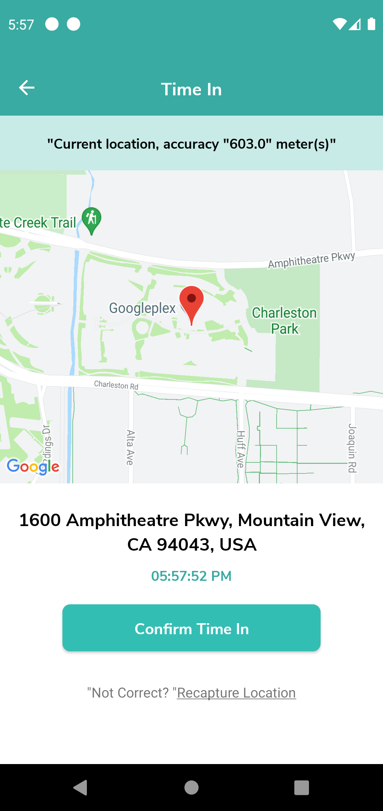
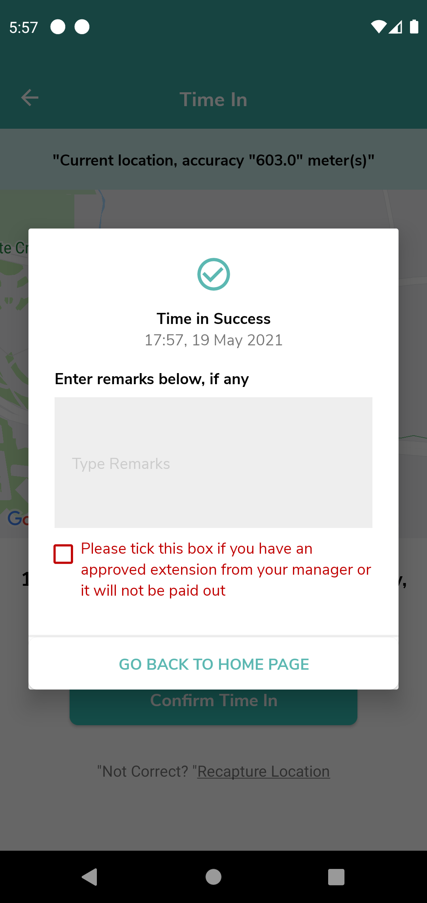
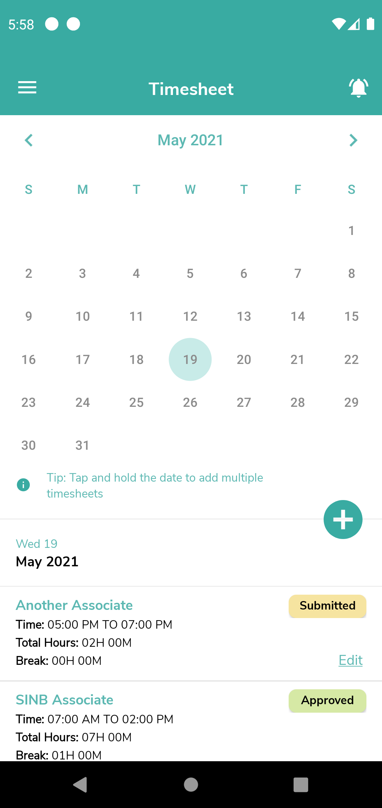

# Octomate Prototype

## Screenshots

<p float="left">
  
   
  
  
  
  
  
</p>

## Getting Started

These instructions will get you a copy of the project up and running on your local machine for development and testing purposes. See deployment for notes on how to deploy the project on a live system.

### Prerequisites

* Android Studio 4.1.3 or latest

### Installing

```
1. Clone or download this project
2. Open the project using Android Studio
3. Replace YOUR_API_KEY string value on app/src/main/res/values/google_maps_api.xml with your own Google Maps API Key
4. Run using an Android emulator or real device (Tested on Android 11)
```

## Built With

* CameraX
* Coil
* Coroutines
* Fused Location Provider
* Jetpack DataStore Preferences
* Jetpack Navigation
* Koin
* Retrofit
* Moshi
* OkHttp
* Timber
* MVVM architectural pattern

## Author

Prima Santosa - mauliawan@primasantosa.com

## License
This project is licensed under the MIT License - see the [LICENSE](LICENSE) file for details
